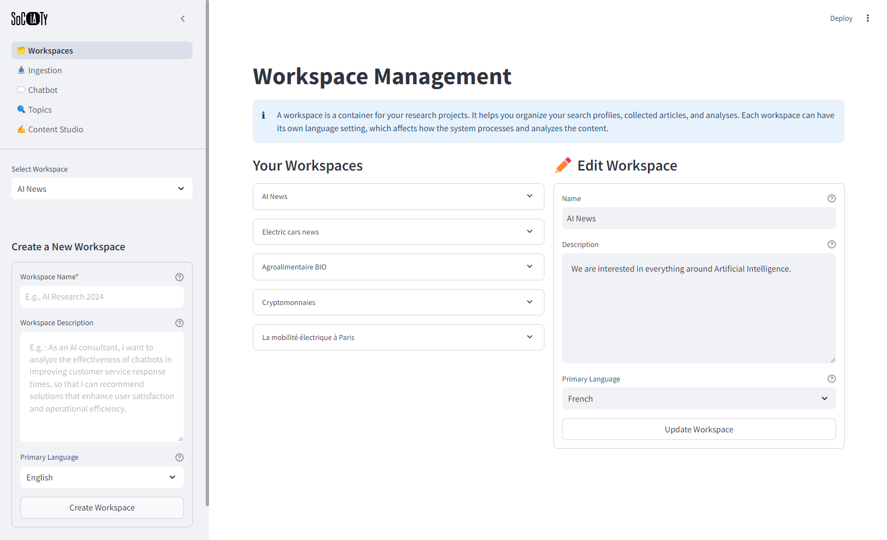
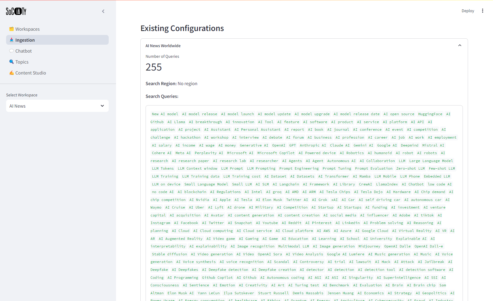
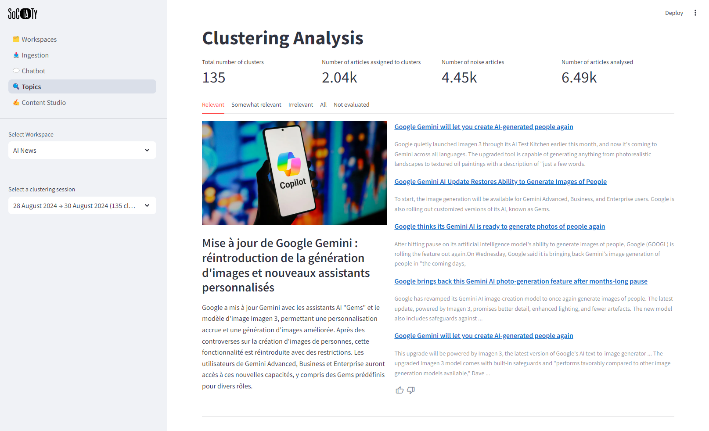
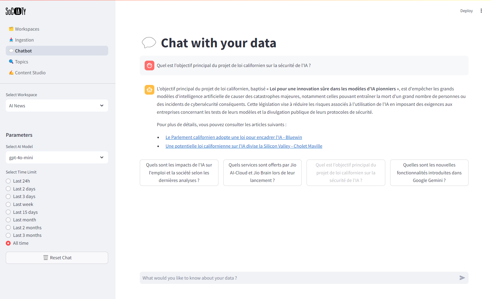
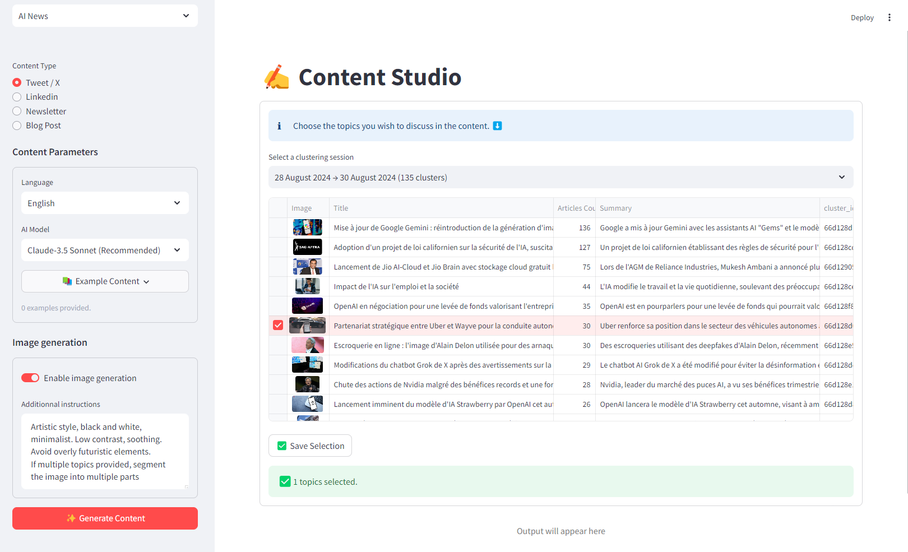
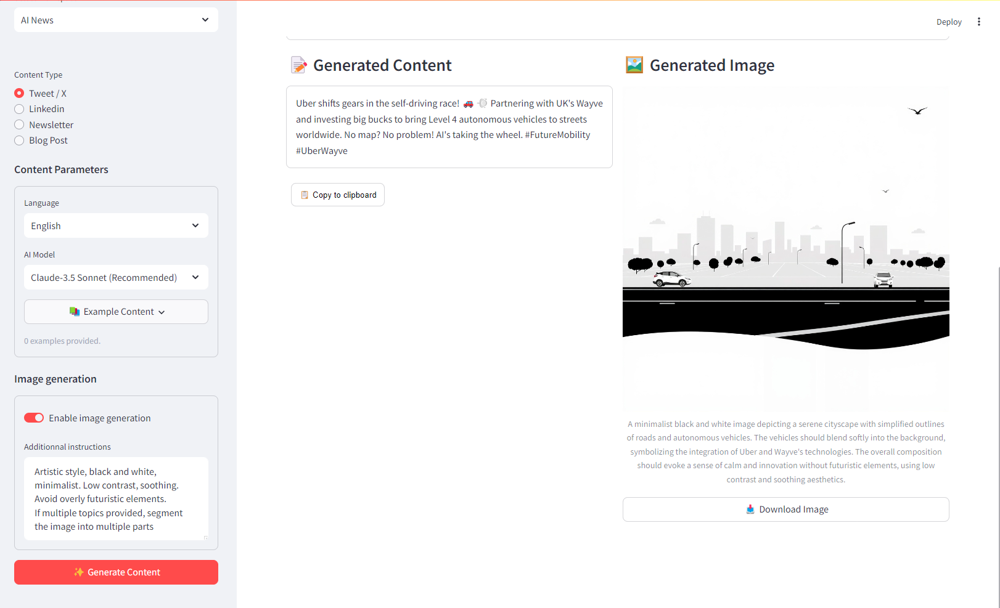

# SO Insights

SO Insights is a comprehensive system for collecting, analyzing, and deriving insights from large volumes of online content. It combines web scraping, topic detection using HDBSCAN and LLMs, a chatbot and content generation utilities.



- **Workspaces**: Manage multiple workspaces for different projects or topics.


- **Ingestion**: Collect news insights from online sources based on user-defined queries.


- **Topics**: Analyze and visualize the detected topics in the collected articles.


- **Chatbot**: Ask any question on your data.


- **Content Studio**: Select the topic and generate content for blog posts, Linkedin, Twitter/X, etc.




## Project Components

SO Insights consists of four main components:

1. **Ingester**: Collects and stores articles from various online sources.
2. **Analyzer**: Processes collected articles, performs clustering, and generates insights.
3. **Backend**: Provides API endpoints for data access and management.
4. **Frontend**: Web-based user interface for interacting with the system.

### Ingester

The Ingester component is responsible for:
- Performing web searches to online news sources based on user predefined queries
- Storing articles in MongoDB and indexing them in Pinecone

### Analyzer

The Analyzer component handles:
- Clustering of articles using HDBSCAN algorithm
- Generating titles summaries for clusters using LLMs
- Evaluating the relevance and quality of clusters based on user preferences

### Backend

The Backend provides:
- RESTful API endpoints for data access and management on the frontend

### Frontend

The Frontend offers a Streamlit interface for:
- Managing workspaces and search queries
- Viewing ingestion results and cluster analyses
- Interacting with a Chatbot with Retrieval-Augmented-Generation (RAG) 
- Generating content for blog posts, Linkedin, Twitter/X, etc based on detected topics with images.

## Tech Stack

- **Language**: Python 3.12+
- **Databases**: MongoDB
- **API Framework**: FastAPI
- **Frontend Framework**: Streamlit
- **Clustering**: scikit-learn, HDBSCAN
- **LLMs**: LangChain with `gpt-4o-mini`
- **Image Generation**: GetImg.ai API and Flux
- **Vector Database**: Pinecone
- **Dependency Management**: Poetry
- **Deployment**: Docker and Streamlit Community Cloud

## Getting Started

1. Clone the repository:
   ```
   git clone https://github.com/SuperMuel/so_insights.git
   cd so-insights
   ```

2. Install dependencies for all components:
   ```
   poetry install
   ```

> [!IMPORTANT]
> Each component has its own setup. Refer to the README in each component's directory for specific instructions.

### Deploy with Docker
- **Ingester**
   ```
    docker build -t so-insights-ingester -f Dockerfile.ingester .
    docker run --env-file ./ingester/.env so-insights-ingester .
    ```
- **Analyzer**
    ```
     docker build -t so-insights-analyzer -f Dockerfile.analyzer .
     docker run --env-file ./analyzer/.env so-insights-analyzer .
     ```


## Usage

1. Use the Frontend to create workspaces and set up search queries.
2. Run the Ingester to collect articles based on the queries.
3. Use the Analyzer to process the collected articles and generate insights.
4. Explore the results and interact with the data using the Frontend's interface.
5. Generate content for blog posts, Linkedin, Twitter/X, etc based on detected topics with images.
